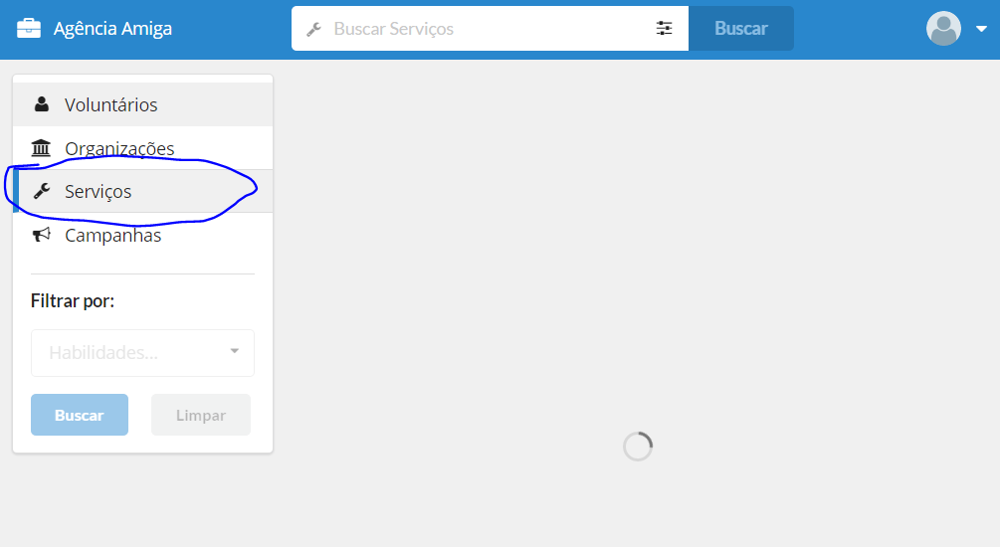

## Agência Amiga

Projeto para dispensa de disciplina (FPIN).

### Pre-requisitos

[Node.js 6.x](https://nodejs.org/en/)

### Funcionalidades:

 - Login/Cadastro de usuários
 - Atualização dos dados do usuário (com cadastro das habilidades)
 - CRUD de serviços e campanhas (para organizações)
 - Listagem dos resultados

### Tecnologias

 - [Babel](https://babeljs.io/)
 - [React](https://facebook.github.io/react/)
 - [React Router](https://reacttraining.com/react-router/)
 - [Redux](http://redux.js.org/)
 - [Redux Saga](https://redux-saga.github.io/redux-saga/)
 - [Semantic UI](http://react.semantic-ui.com/introduction)
 - [Webpack](https://webpack.js.org/)
 - [Firebase](https://firebase.google.com/)
 - [Express](http://expressjs.com/)

### Instruções

Executar no terminal:

```
git clone git@gitlab.com:djalmajr/agencia-amiga.git
npm install
npm start
```

Visitar [http://localhost:3000](http://localhost:3000)

Obs1: Numa das minha refatorações, acabei quebrando o filtro de busca... Para exibir os resultados, deve-se clicar no menu lateral (ver figura).

Obs2: Em alguns casos, depois que o usuário completa os dados do cadastro, a tela fica em status de carregamento (não cheguei a investigar esse problema). Nesse caso, basta dar refresh na página.



